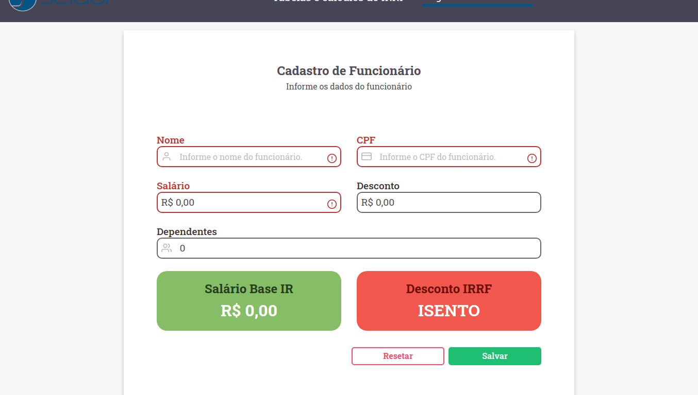
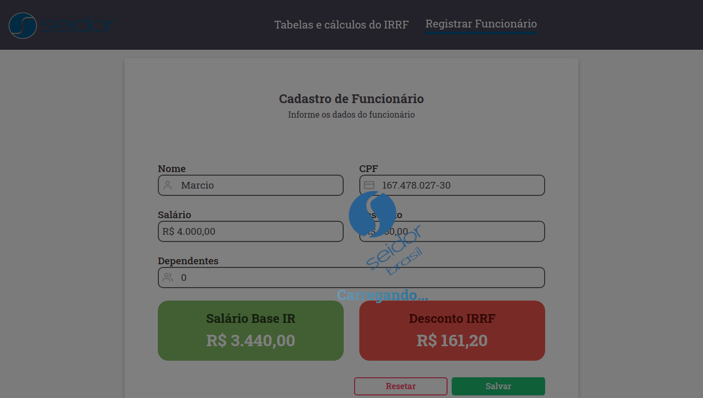
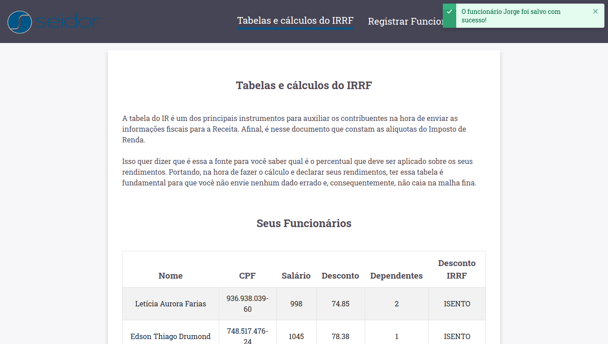

<p align="center">
   
</p>

<p align="center">
   <a href="https://www.linkedin.com/in/tavareshenrique/">
      
   </a>
 

  <a aria-label="Last Commit" href="https://github.com/tavareshenrique/4taxcloud/commits/master">
    
  </a>
  <a href="https://github.com/tavareshenrique/4taxcloud/commits/master">
    
  </a>
  
</p>

> 4TaxCloud é um software que ajuda as empresas a gerenciar o cálculo do imposto de renda retido na fonte (IRRF) para cada um de seus funcionários

<p align="center">
    <a href="README.md">Inglês</a>
    ·
    <a href="README-pt.md">Português</a>
 </p>

<div align="center">
  <sub>O projeto 4TaxCloud. Desenvolvido com ❤︎ por
    <a href="https://github.com/tavareshenrique">Henrique Tavares</a>
  </sub>
</div>

# :pushpin: Conteúdo

* [Demo](#eyes-demo)
* [Tecnologias](#computer-tecnologias)
* [Como Executar](#construction_worker-como-executar)
* [Autor](#computer-autor)
* [Licença](#closed_book-licença)

<h2 align="left"> 📥 Prototipação: </h2>
<p align="center">
    <a href="https://www.figma.com/file/z0MPYjEn2TEmGcQnAzc7X2/4TaxCloud?node-id=0%3A1">
        
    </a>
</p>

### Fotos

<div>
   
   
   
   
   
   
</div>

# :eyes: Demo

Você pode acessar o projeto por aqui:
👉  demo: <https://4taxcloud.henriquetavares.com/>

🚨 **Mas Lembre-se: É apenas uma Demo, você não vai conseguir salvar seus dados, pois não tem uma API executando por trás.**

🤩 **Maaaaaaas, você pode fazer funcionar, você só precisa iniciar o server na sua localhost e pronto. Como você faz isso? Apenas siga os passos abaixo de "Como Executar".**

[](https://app.netlify.com/sites/4taxcloud/deploys)

# :computer: Tecnologias

Este projeto foi feito utilizando as seguintes tecnologias:

* [Typescript](https://www.typescriptlang.org/)
* [React](https://reactjs.org/)
* [Axios](https://github.com/axios/axios)
* [Boostrap](https://github.com/twbs/bootstrap)
* [React Boostrap](https://github.com/react-bootstrap/react-bootstrap)
* [Unform](https://github.com/Rocketseat/unform)
* [CPF-CNPJ Validator](https://github.com/carvalhoviniciusluiz/cpf-cnpj-validator)
* [Polished](https://github.com/styled-components/polished)
* [React Icons](https://github.com/react-icons/react-icons)
* [React Input Mask](https://github.com/sanniassin/react-input-mask)
* [React Intl Currency Input](https://github.com/thiagozanetti/react-intl-currency-input)
* [React Router DOM](https://github.com/ReactTraining/react-router)
* [React Toast Notifications](https://github.com/jossmac/react-toast-notifications)
* [Sweetalert2](https://github.com/sweetalert2/sweetalert2)
* [SWR](https://github.com/vercel/swr)
* [UUIDV4](https://github.com/thenativeweb/uuidv4)
* [React Testing Library](https://github.com/testing-library/react-testing-library)
* [Cypress](https://github.com/cypress-io/cypress)
* [Jest](https://jestjs.io/)
* [Faker](https://github.com/Marak/Faker.js)
* [Jest-Environment JSDOM Sixteen](https://github.com/SimenB/jest-environment-jsdom-sixteen)
* [Axios Mock Adapter](https://github.com/ctimmerm/axios-mock-adapter)
* [Prettier](https://github.com/prettier/prettier)
* [React App Rewired](https://github.com/facebook/react/tree/master/packages/react-test-renderer)
* [React Test Renderer](https://github.com/facebook/react/tree/master/packages/react-test-renderer)
* [ESLint](https://github.com/eslint/eslint)
* [ESLint Airbnb](https://github.com/airbnb/javascript)
* [Prettier](https://github.com/prettier/prettier)

# :construction_worker: Como Executar

```bash
# Faça o clone do repositório
$ git@github.com:tavareshenrique/4taxcloud.git
```

### 📦 Execute a API

🚨 **Atenção que este projeto está usando [JSON Server](https://github.com/typicode/json-server), é necessário que você tenha o JSON Server instalado para prosseguir.**

Se você não tem JSON Server instalado, use o comando abaixo para instalar, ou vá para o perfil oficial do [JSON Server](https://github.com/typicode/json-server) no github para mais detalhes.

```bash
# Instalando o JSON Server
npm install -g json-server
```

Tudo certo? Vamos continuar. 😜

```bash
# Baixe todas a dependencias
$ yarn

# Inicie o JSON Server
$ yarn server
```

Você pode acessar a API depois de executado o comando por aqui: <http://localhost:3333/funcionarios>

### 💻 Executando o Projeto Web

```bash
# Execute a aplicação
$ yarn start
```

Vá para  <http://localhost:3000/> para ver o resultado.

### ✅ Executando os Testes e2e usando a React Testing Library

A **React Testing Library** foi usada para realizar todos os testes e2e individuais para cada componente da aplicação e cada um dos seus hooks.

```bash
# Executando todos os testes
$ yarn test:watch
```

### ☑ Executando os Testes e2e usando o Cypress

O **Cypress** foi utilizado para realizar todos os testes e2e individuais em cada página do aplicativo, neste caso: "Home" e "Employee".

Antes de executar os testes no Cypress, é necessário executar um servidor de teste.

**Então, é muito importante que você finalize o servidor do JSON Server, pois vai precisar utilizar o de testes agora.**

```bash
# Inicie O Server de Testes do Cypress
$ yarn cypress:server

# Execute os Testes no Cypress com o comando abaixo:
$ yarn cypress:run

# ou com o comando:

$ yarn cypress:open
```

Clique em **Run all specs** para ver a mágica acontecer.
<div>
   
</div>

# :computer: Autor

<table>
  <tr>
    <td align="center">
      <a href="http://github.com/tavareshenrique/">
        
        <br />
        <sub>
          <b>Henrique Tavares</b>
        </sub>
       </a>
       <br />
       <a href="https://www.linkedin.com/in/tavareshenrique/" title="Linkedin">@tavareshenrique</a>
       <br />
       <a href="https://github.com/tavareshenrique/4taxcloud/commits?author=tavareshenrique" title="Code">💻</a>
    </td>
  </tr>
</table>

# :closed_book: Licença

Meus agradecimentos ao [Elan Fraga](https://gist.github.com/elanfraga) por me ajudar com os calculos matemáticos e a empresa [Seidor](https://www.seidor.com.br/content/seidor-latam-br/pt.html) pelo desafio.

Esse projeto é possui [MIT license](./LICENSE).
