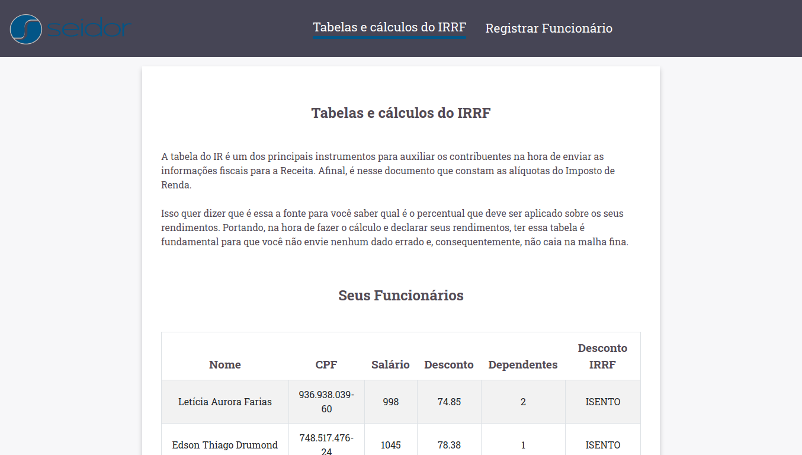
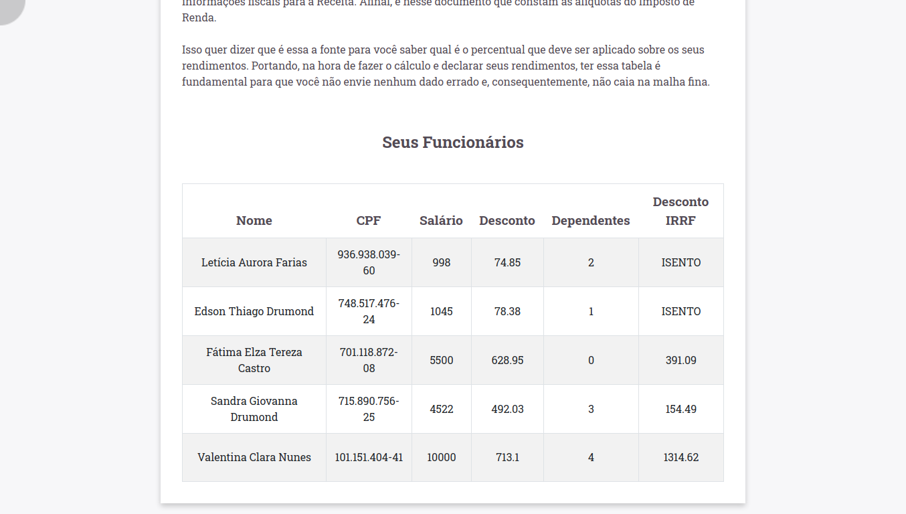
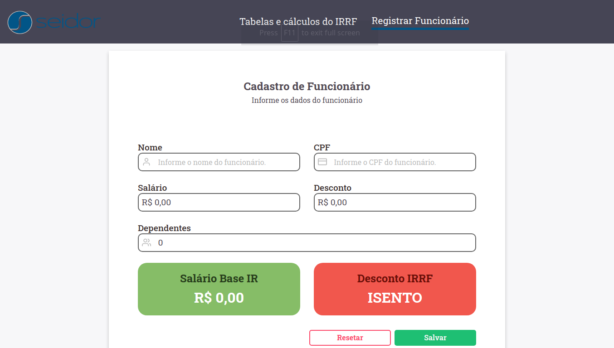
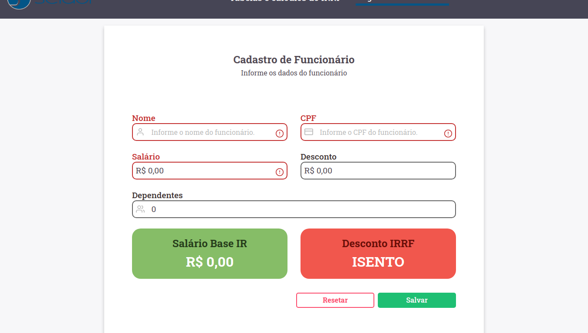
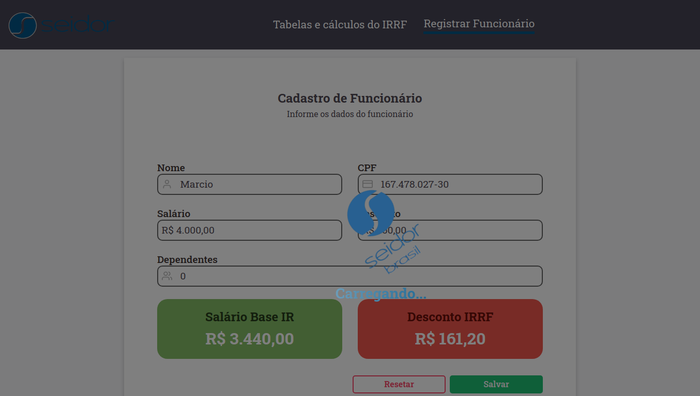
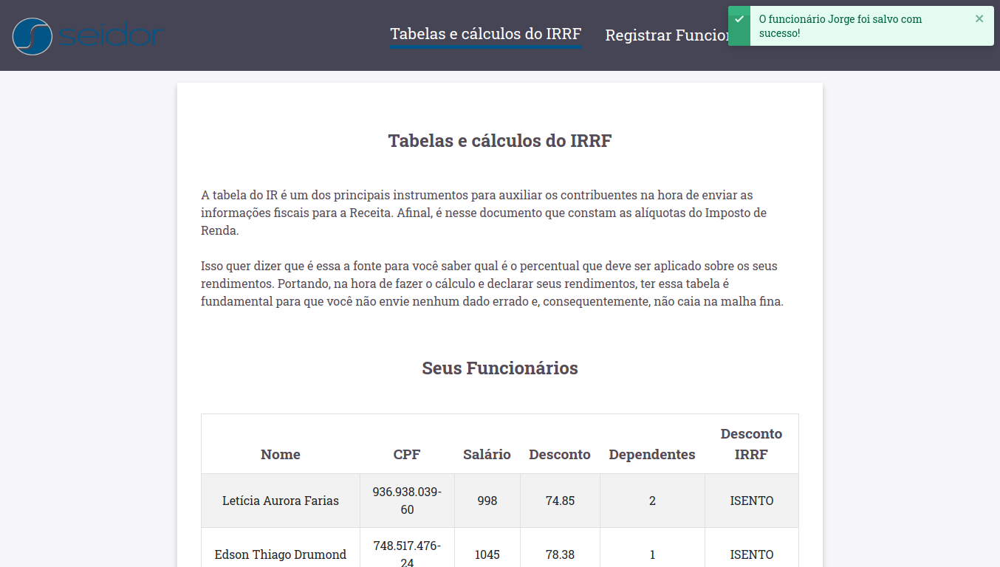
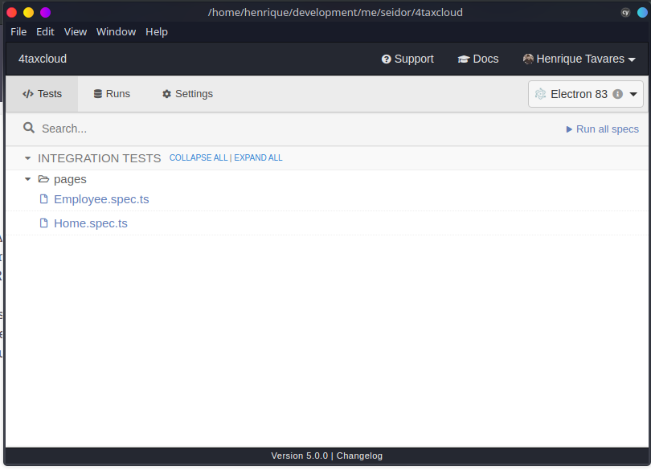

<p align="center">
   
</p>

<p align="center">
   <a href="https://www.linkedin.com/in/tavareshenrique/">
      
   </a>
 

  <a aria-label="Last Commit" href="https://github.com/tavareshenrique/4taxcloud/commits/master">
    
  </a>
  <a href="https://github.com/tavareshenrique/4taxcloud/commits/master">
    
  </a>
  
</p>

> 4TaxCloud is software that helps companies manage our withholding income tax (IRRF) calculation for each of their employees.

<p align="center">
    <a href="README.md">English</a>
    ·
    <a href="README-pt.md">Portuguese</a>
 </p>

<div align="center">
  <sub>The 4TaxCloud project. Built with ❤︎ by
    <a href="https://github.com/tavareshenrique">Henrique Tavares</a>
  </sub>
</div>

# :pushpin: Table of Contents

* [Demo Website](#eyes-demo-website)
* [Technologies](#computer-technologies)
* [Features](#rocket-features)
* [How to Run](#construction_worker-how-to-run)
* [Found a bug? Missing a specific feature?](#bug-issues)
* [Contributing](#tada-contributing)
* [License](#closed_book-license)

<h2 align="left"> 📥 Layout at: </h2>
<p align="center">
    <a href="https://www.figma.com/file/z0MPYjEn2TEmGcQnAzc7X2/4TaxCloud?node-id=0%3A1">
        
    </a>
</p>

### Web Screenshot

<div>
   
   
   
   
   
   
</div>

# :eyes: Demo Website

You can acess the website at:
👉  demo: <https://4taxcloud.henriquetavares.com/>
🚨 **Remember: I'ts a only demo, don't have a API to save your data.**

[](https://app.netlify.com/sites/4taxcloud/deploys)

# :computer: Technologies

This project was made using the follow technologies:

* [Typescript](https://www.typescriptlang.org/)
* [React](https://reactjs.org/)
* [Axios](https://github.com/axios/axios)
* [Boostrap](https://github.com/twbs/bootstrap)
* [React Boostrap](https://github.com/react-bootstrap/react-bootstrap)
* [Unform](https://github.com/Rocketseat/unform)
* [CPF-CNPJ Validator](https://github.com/carvalhoviniciusluiz/cpf-cnpj-validator)
* [Polished](https://github.com/styled-components/polished)
* [React Icons](https://github.com/react-icons/react-icons)
* [React Input Mask](https://github.com/sanniassin/react-input-mask)
* [React Intl Currency Input](https://github.com/thiagozanetti/react-intl-currency-input)
* [React Router DOM](https://github.com/ReactTraining/react-router)
* [React Toast Notifications](https://github.com/jossmac/react-toast-notifications)
* [Sweetalert2](https://github.com/sweetalert2/sweetalert2)
* [SWR](https://github.com/vercel/swr)
* [UUIDV4](https://github.com/thenativeweb/uuidv4)
* [React Testing Library](https://github.com/testing-library/react-testing-library)
* [Cypress](https://github.com/cypress-io/cypress)
* [Jest](https://jestjs.io/)
* [Faker](https://github.com/Marak/Faker.js)
* [Jest-Environment JSDOM Sixteen](https://github.com/SimenB/jest-environment-jsdom-sixteen)
* [Axios Mock Adapter](https://github.com/ctimmerm/axios-mock-adapter)
* [Prettier](https://github.com/prettier/prettier)
* [React App Rewired](https://github.com/facebook/react/tree/master/packages/react-test-renderer)
* [React Test Renderer](https://github.com/facebook/react/tree/master/packages/react-test-renderer)
* [ESLint](https://github.com/eslint/eslint)
* [ESLint Airbnb](https://github.com/airbnb/javascript)
* [Prettier](https://github.com/prettier/prettier)

# :construction_worker: How to run

```bash
# Clone Repository
$ git@github.com:tavareshenrique/4taxcloud.git
```

### 📦 Run API

🚨 **Attention this project is using [JSON Server](https://github.com/typicode/json-server), it is necessary that you have JSON Server installed to proceed.**

If you do not have JSON Server installed, use the command below to install, or go to the official [JSON Server](https://github.com/typicode/json-server) github for more details.

```bash
# Installing JSON Server
npm install -g json-server
```

All right? Let's continue. 😜

```bash
# Download all dependencies
$ yarn

# Start the JSON Server
$ yarn server
```

Access API at <http://localhost:3333/funcionarios>

### 💻 Run Web Project

```bash
# Run Aplication
$ yarn start
```

Go to <http://localhost:3000/> to see the result.

### ✅ Run e2e Tests using React Testing Library

The React Testing Library was used to perform all individual e2e Tests for each Component of the application and the hooks.

```bash
# Run all tests
$ yarn test:watch
```

### ☑ Run e2e Tests using Cypress

Cypress was used to perform all individual e2e tests on each page of the application, in this case: Home and Employees.

Before running Cypress tests, it is necessary to run a test server.

**So, terminate your JSON Server.**

```bash
# Run Cypress Server Test
$ yarn cypress:server

# Run Cypress Tests
$ yarn cypress:run

# or

$ yarn cypress:open
```

Click in **Run all specs**
<div>
   
</div>

# :closed_book: License

Released in 2020 :closed_book: License

Made with love by [Henrique Tavares](https://github.com/tavareshenrique) 🚀.

My thanks to [Elan Fraga](https://gist.github.com/elanfraga) for helping with the calculations and to [Seidor](https://www.seidor.com.br/content/seidor-latam-br/pt.html) for the challenge.

This project is under the [MIT license](./LICENSE).
